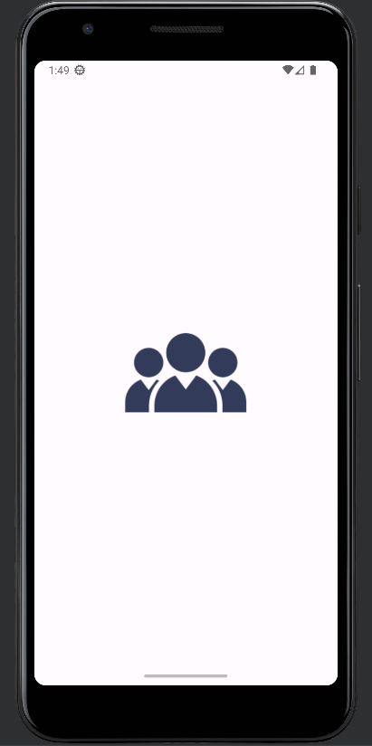
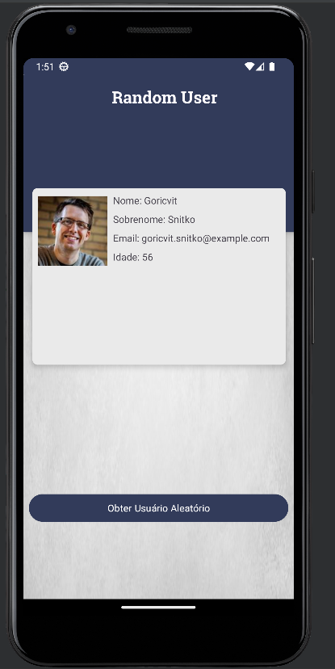
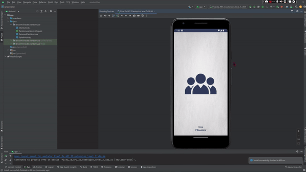

# Projeto-002--Random_User
 Projeto realizado com Consumo de API, utilizando Retrofit e convertendo Json para Gson

➜ Objetivo: Criar um aplicativo que exiba um usuário aleatório a partir de um WebService

Passos:

    > Configuração de um projeto Android básico com uma interface de usuário simples contendo um botão "Obter Usuário Aleatório" e uma área de exibição para mostrar as informações do usuário. 

    > Utilizado a biblioteca Retrofit para fazer uma requisição GET ao endpoint do RandomUser.

    > Ao receber a resposta do webservice, foi analisado o JSON retornado para obter informações sobre o usuário, como nome, email, etc.

    > Apresentado as informações do usuário na interface gráfica do aplicativo.

<h3>First screen<h3>

<!--------------------------------------------------->

<h3>Second screen<h3>

<!--------------------------------------------------->

<h3>Third screen<h3>

<!--------------------------------------------------->

<h3>Fourth screen<h3>

<!--------------------------------------------------->

<h3>API<h3>

<!--------------------------------------------------->

<h3>Demo GIF<h3>
